目次
- [前提](#前提)
- [Twitter APIの準備](#twitter-apiの準備)
- [Google Photoのクレデンシャル作成](#google-photoのクレデンシャル作成)
- [Terraformを用いた構築](#terraformを用いた構築)

# 前提
- [Terraform](https://learn.hashicorp.com/tutorials/terraform/install-cli)がインストール済み。
- [Cloud SDK](https://cloud.google.com/sdk/docs/install)がインストール済み。
- [Google Cloud プロジェクト](https://cloud.google.com/resource-manager/docs/creating-managing-projects)が作成されており、[プロジェクトの課金が有効化](https://cloud.google.com/billing/docs/how-to/modify-project)されている。
- `gcloud auth application-default login`でログイン済み。
- Python3.9がインストール済み。

# Twitter APIの準備

Twitter APIを利用するためのクレデンシャルを作成します。

まず、Bot用のアカウントを[Twitter Signup](https://twitter.com/i/flow/signup)で作成してください。
Google Photoの写真が公開されるため、「[ツイートを公開または非公開に設定する方法](https://help.twitter.com/ja/safety-and-security/how-to-make-twitter-private-and-public)」を参考に非公開に設定しておくことをお勧めします。
既存アカウントを利用しても問題ありませんが、Google Photoの写真がランダムでツイートされますのでご注意ください。

次に[Twitter Developer Platform](https://developer.twitter.com/en)にアクセスしサインアップします。Twitterアカウントの作成とは別に実施する必要があります。

サインアップを完了したら、[Twitter Developers Dashboard](https://developer.twitter.com/en/portal/dashboard)にアクセスし、ProjectとAppを作成します。App作成後にKeyとTokenが出力されるのでメモしてください。（再度確認できないため、ご注意ください。）

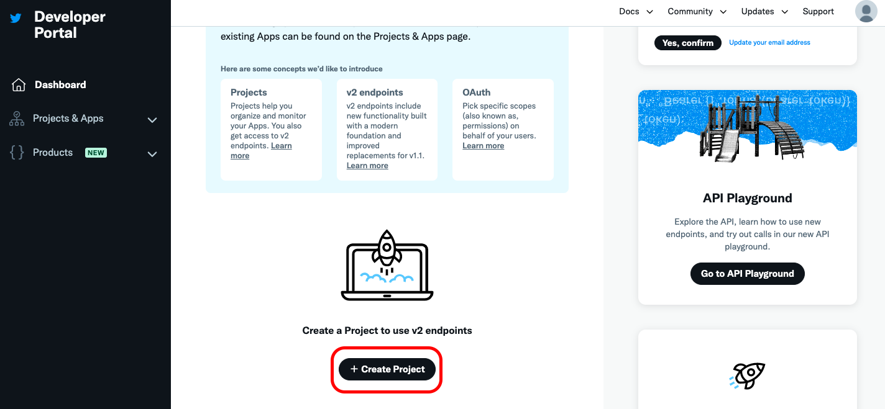  

Appの設定でユーザ認証設定を実施します。

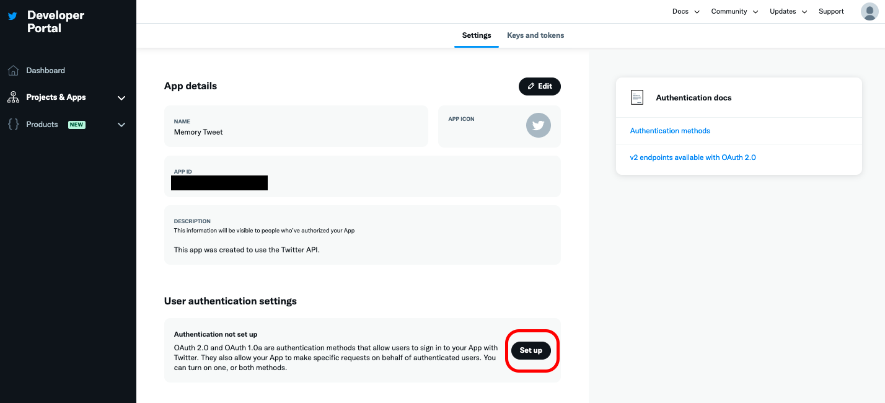  

「OAuth 1.0a」を有効化してください。アプリ権限には「Read and Write」を指定します。

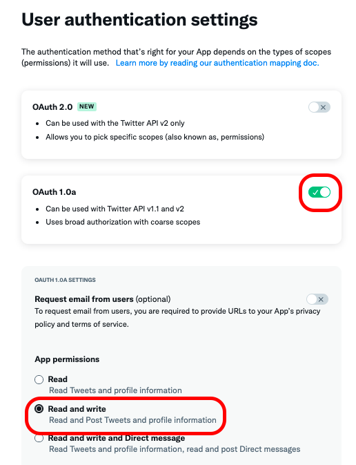  

今回「Callback URI / Redirect URL」と「Website URL」は利用しませんが、OAuthのコールバック先となるので自身で管理するサーバのURLを設定してください。（例のように任意のURLを登録することも可能ですが、セキュリティリスクをご理解した上で自己責任でご設定ください。）最後に最下部の「Save」を押下し設定を保存します。

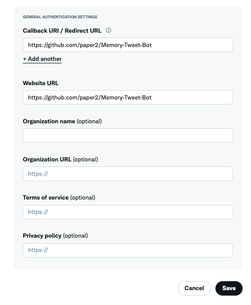  

Appのトップ画面に戻ったら「Keys and tokens」からトークンを発行します。

  

「Access Token and Secret」を押下し、Access TokenとAccess Token Secretをメモします。

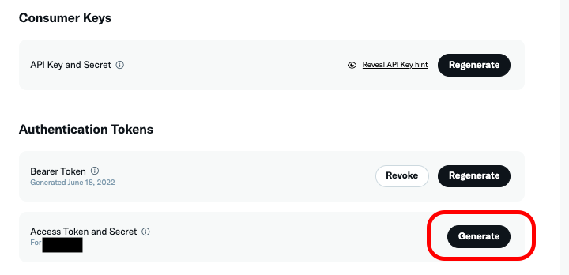  

現時点でメモをしている以下４項目を後工程で利用します。

- API Key
- API Key Secret
- Access Token
- Access Token Secret

次に[Twitter Developers Dashboard](https://developer.twitter.com/en/portal/products/elevated)でElevatedプランに変更します。

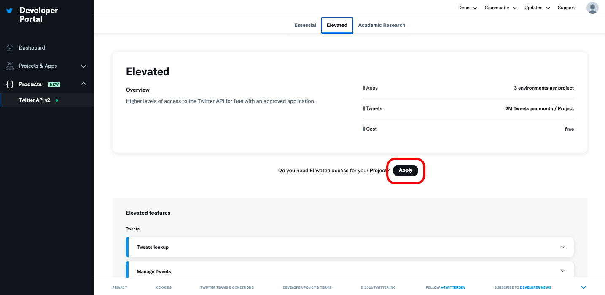  

「Individual developer account」で設定をして、次へ進みます。

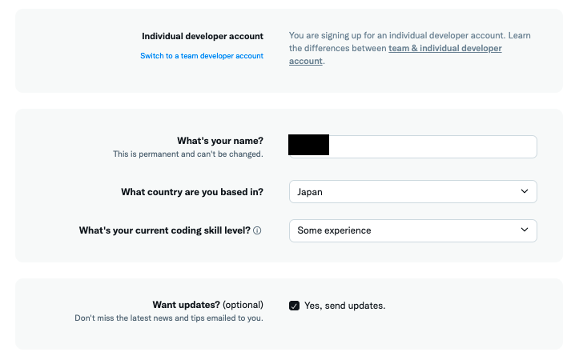  

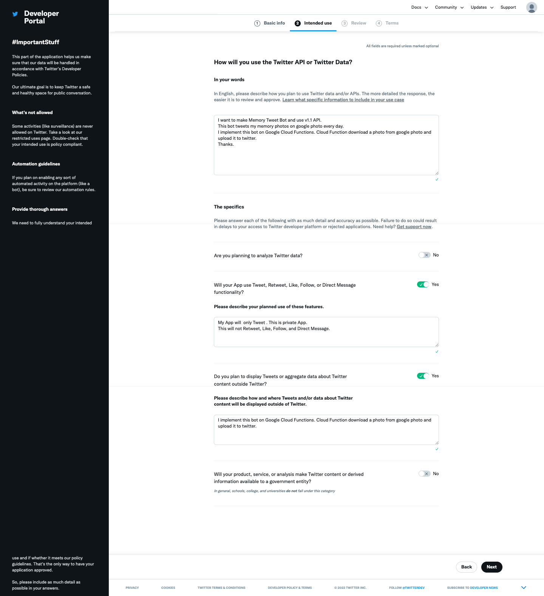  

入力内容を確認して次へ進みます。

「Developer agreement & policy」が表示されるので同意して申請をします。
申請後、すぐ利用できるようになります。

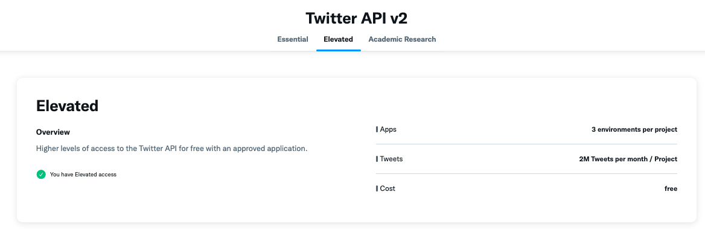  


# Google Photoのクレデンシャル作成

新しいプロジェクトを作成後、[OAuth 同意画面](https://console.cloud.google.com/apis/credentials/consent)の設定をします。

「外部」を選択し、「作成」を押下します。

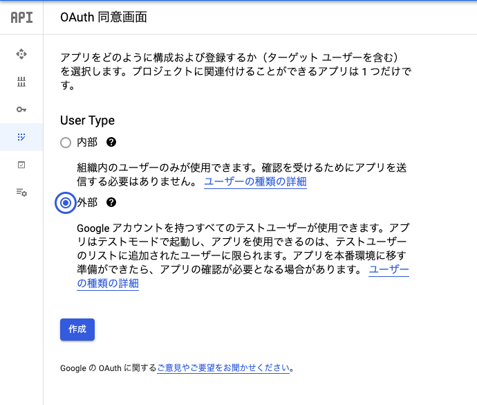  

アプリ名、メールアドレス（自身のgmailアドレス）を埋めて保存して次へ進みます。

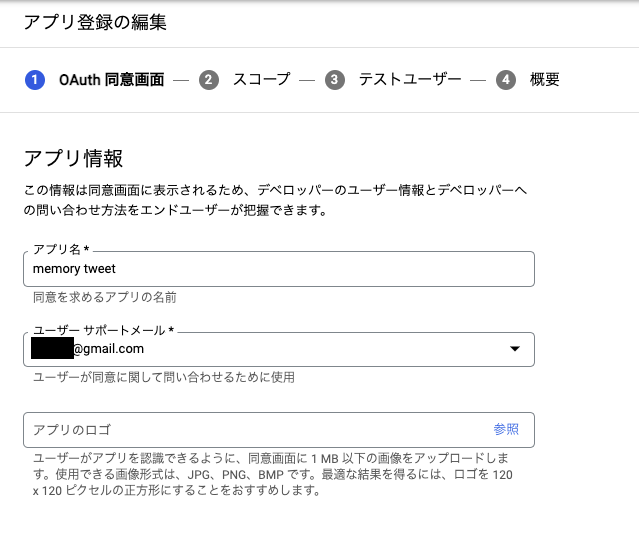  
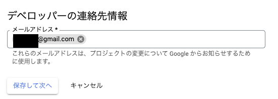  

「スコープを追加または削除」を押下し、出てきた画面を下にスクロールし、「スコープの手動追加」で「 https://www.googleapis.com/auth/photoslibrary.readonly 」と入力し、「テーブルに追加」を押下し、次に「更新」を押下します。

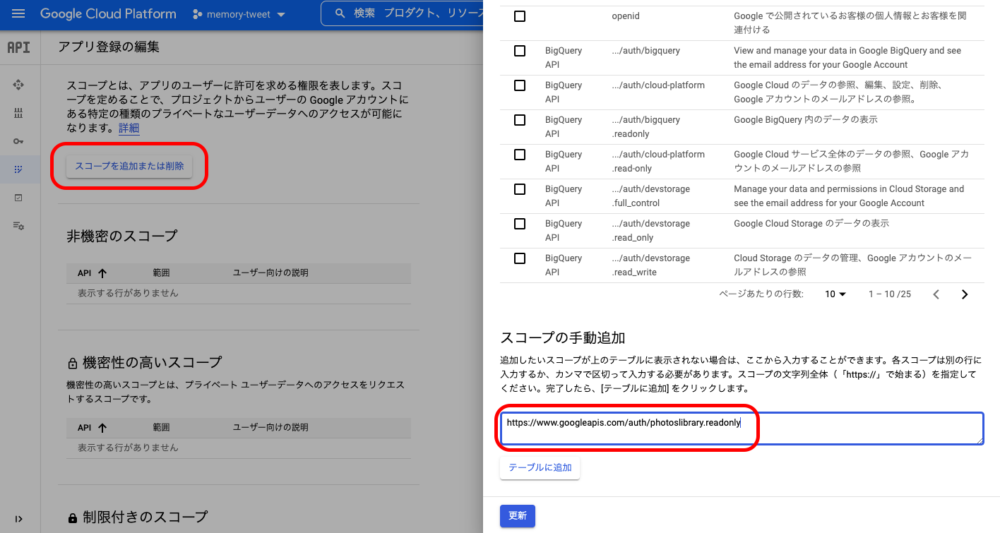  

「機密性の高いスコープ」にスコープが追加されていることを確認してください。保存して次へ進みます。

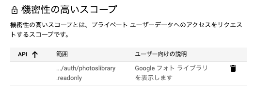  

テストユーザに自身のgmailアカウントを設定、保存して次へ進みます。「概要」が表示されて設定が完了します。

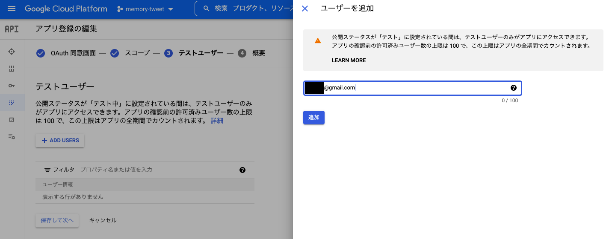  

次に[認証情報](https://console.cloud.google.com/apis/credentials)画面で、OAuthクライアントIDを作成します。

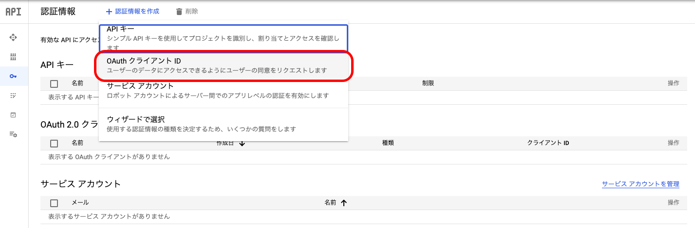  
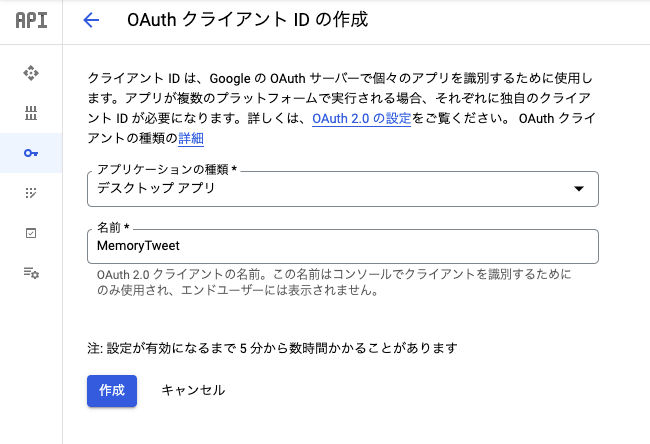  

作成されたら認証情報をJSONで保存します。

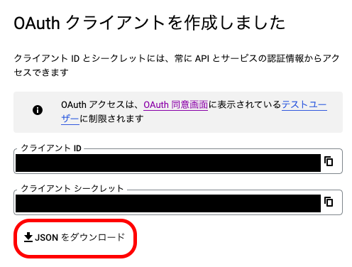  

JSONをsrcディレクトリに「client_secret.json」というファイル名で保存してください。

```
$ pwd
/repository_root

$ ls
LICENSE				doc				src				workspace.code-workspace
README.md			images				terraform

$ ls src/client_secret.json 
src/client_secret.json
```

初期クレデンシャルを発行します。一番最初のみユーザの同意が必要なため手動で作成します。次回以降はrefresh_tokenを用いて自動で更新します。

print_credentials.pyを実行し、表示されたURLにアクセスし、連携するGoogle PhotoのGoogleアカウントでログインと許可を実施します。コマンドプロンプトでは「Enter the authorization code:」と表示され、入力待ちの状態になります。許可後に発行される認可コードを入力します。

```
$ cd src
$ pip install -r requirements.txt
（省略）
$ python print_credentials.py
Please visit this URL to authorize this application: https://accounts.google.com/o/oauth2/auth?response_type=xxxxxxxxxxxxxxx
Enter the authorization code: 
```

「続行」を押下。

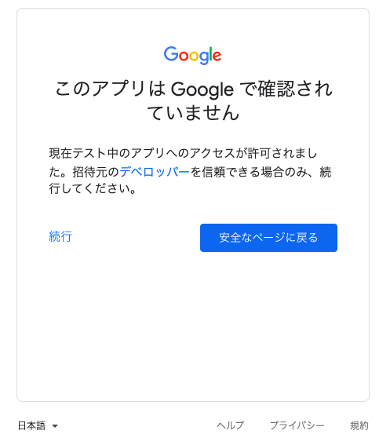  

許可する権限を確認し、「続行」を押下します。

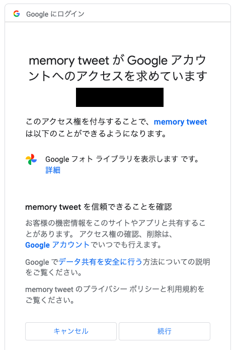  

認可コードをクリップボードにコピーします。

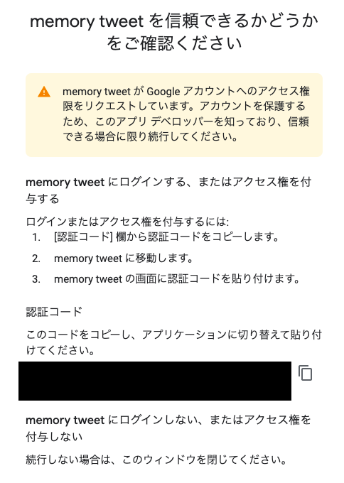  

コマンドプロンプトにコピペし、エンターを押すとクレデンシャルが発行されます。JSON部分をメモしてください。

```
$ python print_credentials.py
Please visit this URL to authorize this application: https://accounts.google.com/o/oauth2/auth?response_type=xxxxxxxxxxxxxxx
Enter the authorization code: xxxxxxxxxxxxxxxxxxxx
CREDENTIALS_JSON: {"token": "xxxxxxxxxxxxxxxx"...}

# リポジトリルートに戻る。
$ cd ..
```

以上で、Google Photo APIを利用する準備は終了です。

# Terraformを用いた構築

さて、ここからはIaCを活用し一気に構築を進めます。一部シークレット情報のみは手動で設定します。

プロジェクトを設定しておきます。

```
$ gcloud auth application-default login
(省略)

$ gcloud config set project <プロジェクトID>
Updated property [core/project].
```

[terraform/variables.tf](../terraform/variables.tf)にプロジェクトや利用するリージョンを設定します。

```
variable "project_id" {
  type    = string
  default = "<プロジェクトID>"
}

variable "region" {
  type    = string
  default = "asia-northeast1"
}

variable "zone" {
  type    = string
  default = "asia-northeast1-a"
}
```

APIを有効化します。

```
$ gcloud services enable cloudfunctions.googleapis.com
$ gcloud services enable cloudscheduler.googleapis.com
$ gcloud services enable pubsub.googleapis.com
$ gcloud services enable secretmanager.googleapis.com
$ gcloud services enable cloudbuild.googleapis.com
$ gcloud services enable photoslibrary.googleapis.com                      
```

`terraform init` を実行します。

```
$ cd terraform 

$ terraform init

Initializing the backend...

Successfully configured the backend "local"! Terraform will automatically
use this backend unless the backend configuration changes.

Initializing provider plugins...
- Reusing previous version of hashicorp/archive from the dependency lock file
- Reusing previous version of hashicorp/google from the dependency lock file
- Installing hashicorp/archive v2.2.0...
- Installed hashicorp/archive v2.2.0 (signed by HashiCorp)
- Installing hashicorp/google v4.25.0...
- Installed hashicorp/google v4.25.0 (signed by HashiCorp)

Terraform has been successfully initialized!

You may now begin working with Terraform. Try running "terraform plan" to see
any changes that are required for your infrastructure. All Terraform commands
should now work.

If you ever set or change modules or backend configuration for Terraform,
rerun this command to reinitialize your working directory. If you forget, other
commands will detect it and remind you to do so if necessary.

```

```
$ terraform apply
（省略）
```

Terraform applyが成功したら、認証情報をSecret Managerに設定します。前述で取得したTwitterの認証情報とGoogle Photoのクレデンシャルを利用します。

```
# Twitterの認証情報を環境変数に設定。
$ TWITTER_CK=<API KEY>
$ TWITTER_CS=<API Key Secret>
$ TWITTER_AT=<Acess Token>
$ TWITTER_AS=<Access Token Secret>

# twitter-credentialsにバージョンを追加。
$ cat <<EOF | gcloud secrets versions add twitter-credentials --data-file=-
{
  "TWITTER_CK": "${TWITTER_CK}",
  "TWITTER_CS": "${TWITTER_CS}",
  "TWITTER_AT": "${TWITTER_AT}",
  "TWITTER_AS": "${TWITTER_AS}"
}
EOF
Created version [1] of the secret [twitter-credentials].

# 確認
$ gcloud secrets versions access latest --secret="twitter-credentials"
{
  "TWITTER_CK": "XXXX",
  "TWITTER_CS": "XXXX",
  "TWITTER_AT": "XXXX",
  "TWITTER_AS": "XXXX"
}

# google-oauth-credentialsにバージョンを追加。
echo '<Google Photoのクレデンシャル>' | gcloud secrets versions add google-oauth-credentials --data-file=-

# 確認
$ gcloud secrets versions access latest --secret="google-oauth-credentials"
{"token": "xxxxxxxxxxxxxxxx"...}

# Shedulerから試しに実行してみる。
$ gcloud scheduler jobs run memory-tweet  --location=asia-northeast1

```

無事ツイートできていれば完成です！うまくいかない場合はまずCloud Functionsのエラーから確認しましょう。

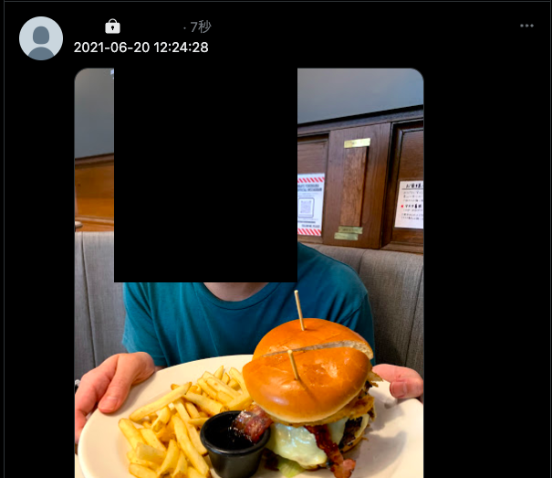  
